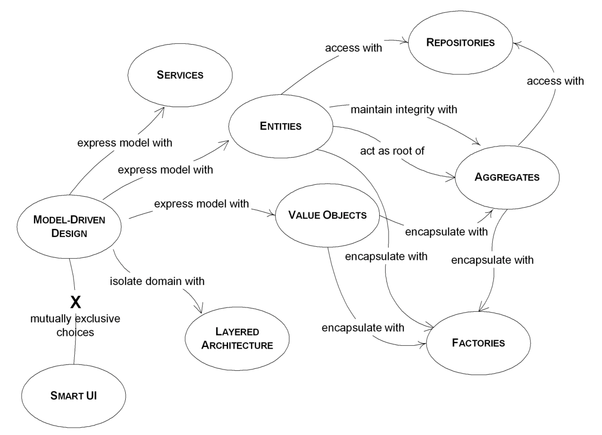

# social-network-challenge

We need your help migrating a legacy social network service.

This service have users that can friend other users and offers an HTTP API to do so.

## run springboot app
```
gradle wrapper
./gradlew build
./gradlew build bootRun
```

or run fat jar
```
java -jar build/libs/friends-rest-service-0.1.0.jar
```

## Dockerize the app: create a docker image and run the project from command line
From the project root folder exec the commands to create a docker image and run it:

for macosx start the docker daemon
```bash
killall Docker && open /Applications/Docker.app
```

then
```bash
docker build -f docker/Dockerfile . -t friends
docker run -p 8080:8080 friends
docker stop $(docker ps -a -q)
docker rm $(docker ps -a -q)
```

to clean docker images
```
docker images
docker rmi PID
``` 

## Swagger
You can see the swagger documentation in the following url:
- http://localhost:8080/swagger-ui.html

### Tips

closing ports
```
sudo lsof -i :8888
sudo kill -9 PID
```

## improvements

- send username in the body instead as parameter,
- send usernames as path paremeters and between the relations of them: 
localhost:8080/friendship/johndoe/requestFriendshipTo/robert
localhost:8080/friendship/robert/acceptFriendshipTo/johndoe
localhost:8080/friendship/robert/declineFriendshipTo/johndoe
localhost:8080/friendship/johndoe/listFriends

- develop a new domain to change the current one
- develop the same model to use JPA and h2 and derby for instance
- develop the versioning in the improvement project

## profiles

to select a profile use the --spring.profiles.active param.
```
java -jar friends-rest-service-0.1.0.jar --spring.profiles.active=dev
```

